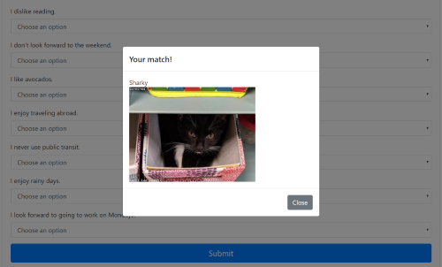

# Friend-Finder

Answer a simple 10 question survey, and Friend Finder will provide you with the best match from it's members.  Friend Finder's back end was constructed with Node.js, and requires the following to run:

* npm express

To run the application, you must first install the above npm from the terminal command line in the root directory.

```npm install express```

After the npm install, the listener must be executed.  Again from the command line, type the following:

```node server.js```

If you are running the application locally, it operates off of PORT 8080.  Enter the following into the address bar:

```localhost:8080```

Then, simply enter your name, provide a URL link to a photo, and answer the 10 questions by weather you agree (5) with the statement, disagree (1), or any answer inbetween.  Your user data will then be compared to the members stored in the local server.  The member with the difference in score closest to your own, will be displayed.



This deployed project can be viewed on [Heroku](https://friend-finder1999.herokuapp.com/).

I was responsible for developing this project from the ground up.  Starting off by creating a basic HTML layout with Bootstrap, I then proceeded to code the bulk of the project with Node.js.  First by creating the express server.  Second, I created  html and api routes, followed by an AJAX call from the front end.  Last, I defined the logic to display the correct match.

Enjoy!
